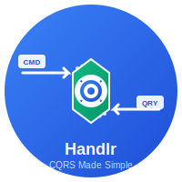

# Handlr CQRS Framework

<div align="center">
  
  <br><br>
  <strong>A modern, source generator-powered CQRS implementation for .NET 9.0</strong>
</div>

## 🚀 Quick Start

```csharp
// Install the NuGet packages
dotnet add package Handlr.Abstractions
dotnet add package Handlr.SourceGenerator

// Define a command
public record CreateUserCommand(string Name, string Email) : ICommand<User>;

// The handler is generated automatically!
// Just inject IMediator and use it
```

## 📚 Documentation

- **[Getting Started Guide](docs/index.md)** - Complete setup and usage guide
- **[API Reference](api/index.md)** - Detailed API documentation
- **[Sample Projects](https://github.com/sodiqyekeen/handlr/tree/main/samples)** - Working examples

## 🛠️ Features

- ✅ **Source Generator Powered** - Zero runtime reflection
- ✅ **CQRS Pattern** - Clean separation of commands and queries  
- ✅ **Pipeline Behaviors** - Validation, logging, caching, and more
- ✅ **Dependency Injection** - Built-in DI container support
- ✅ **High Performance** - Minimal overhead, maximum throughput
- ✅ **.NET 9.0** - Latest .NET features and performance

## 📦 Packages

| Package | Version | Description |
|---------|---------|-------------|
| `Handlr.Abstractions` | [](https://www.nuget.org/packages/Handlr.Abstractions/) | Core abstractions and interfaces |
| `Handlr.SourceGenerator` | [](https://www.nuget.org/packages/Handlr.SourceGenerator/) | Source generator for automatic code generation |

## 🤝 Contributing

We welcome contributions! Visit our [GitHub repository](https://github.com/sodiqyekeen/handlr) to get started.

---

*Built with ❤️ for the .NET community*